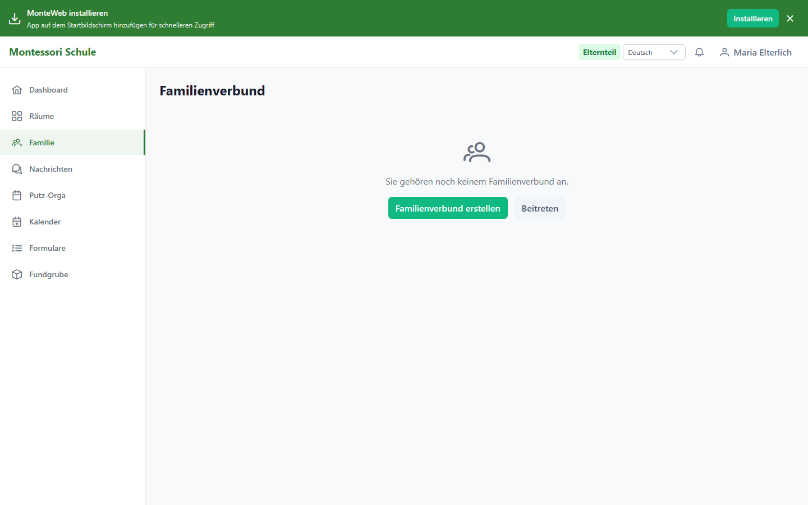
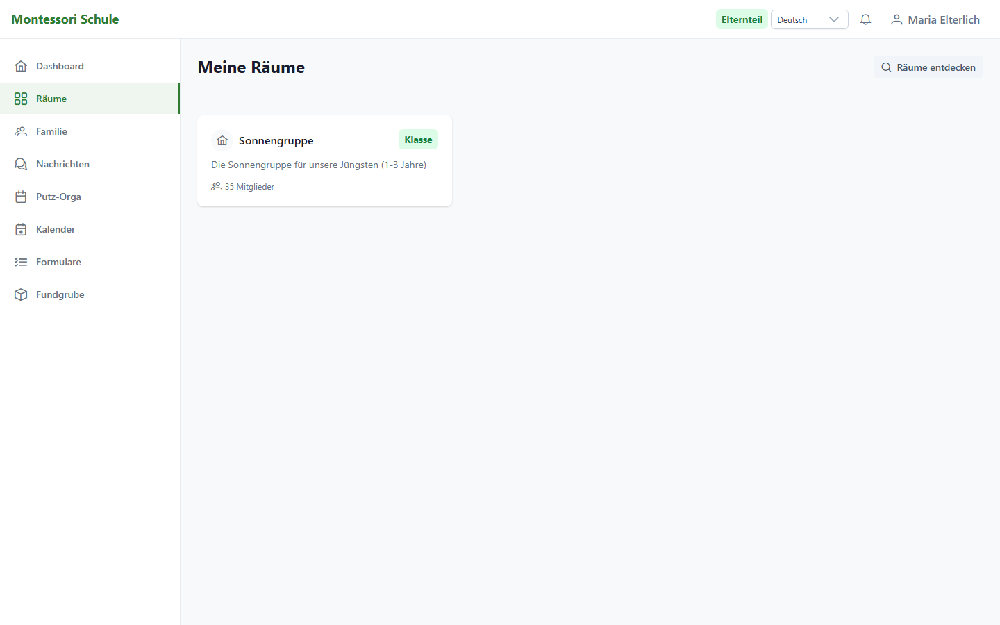
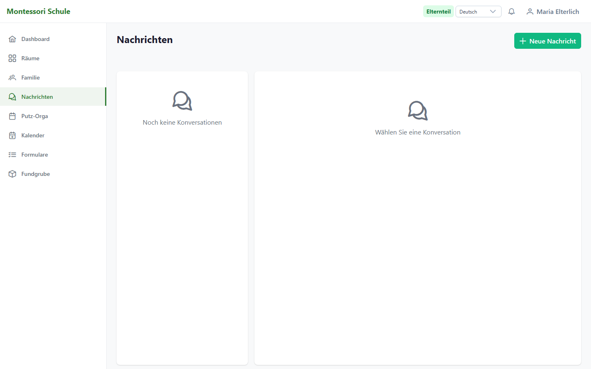
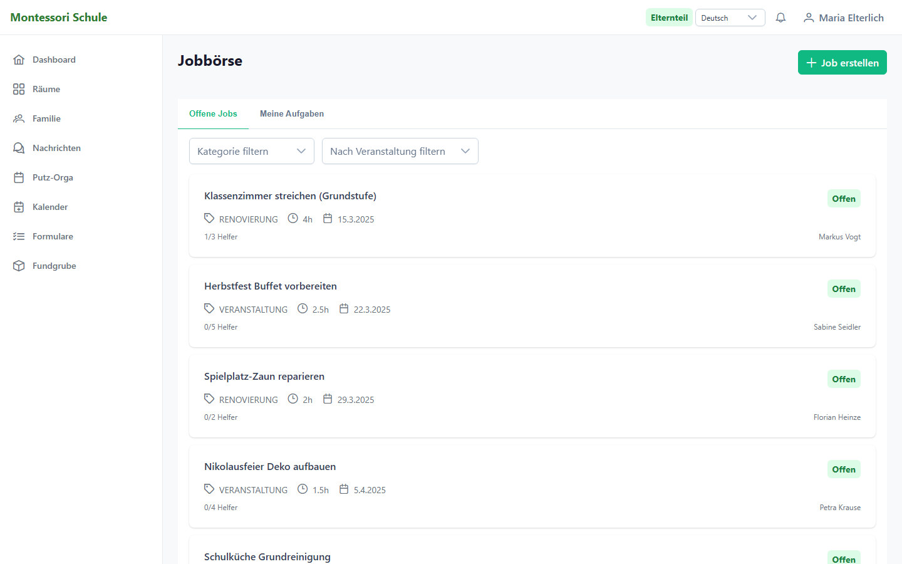
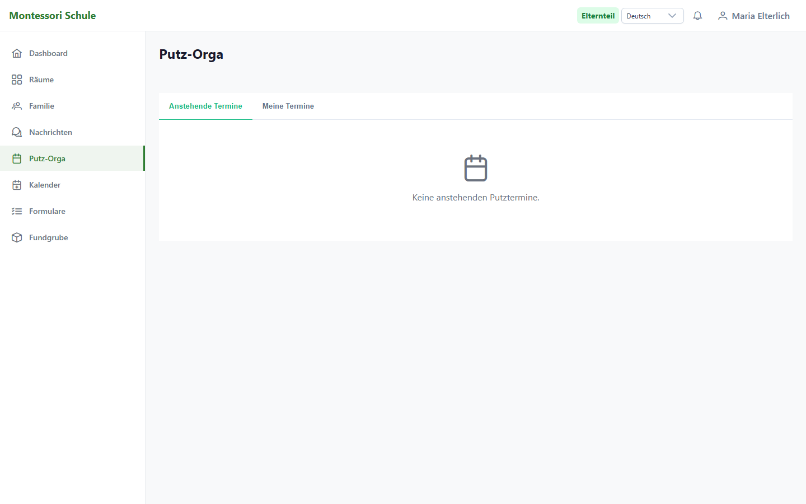
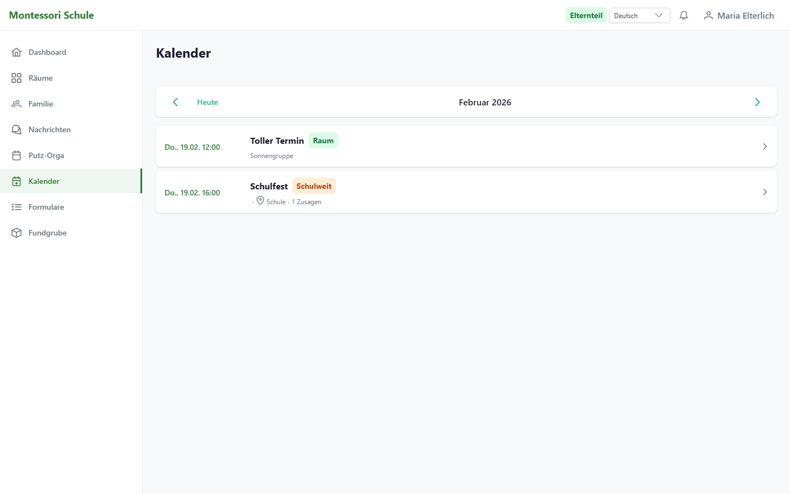
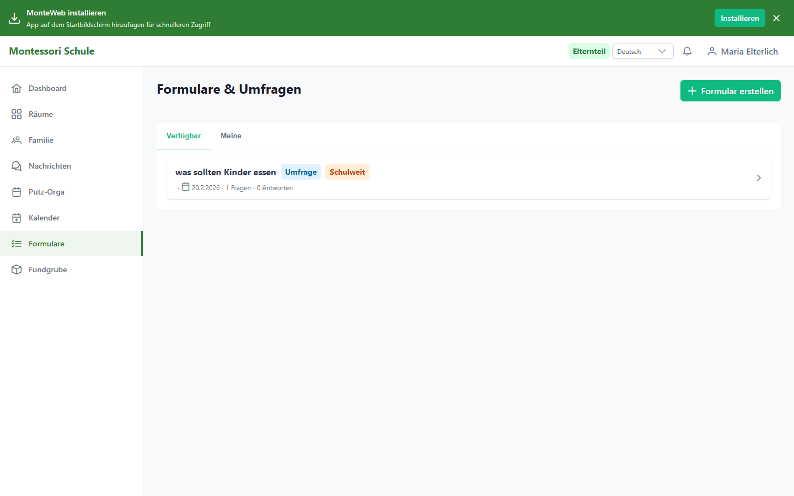
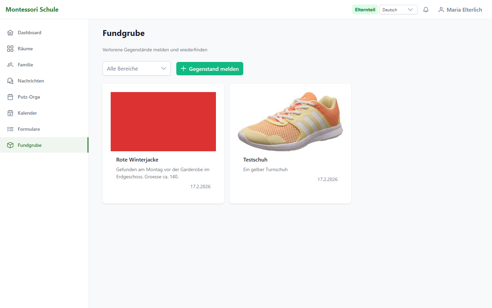
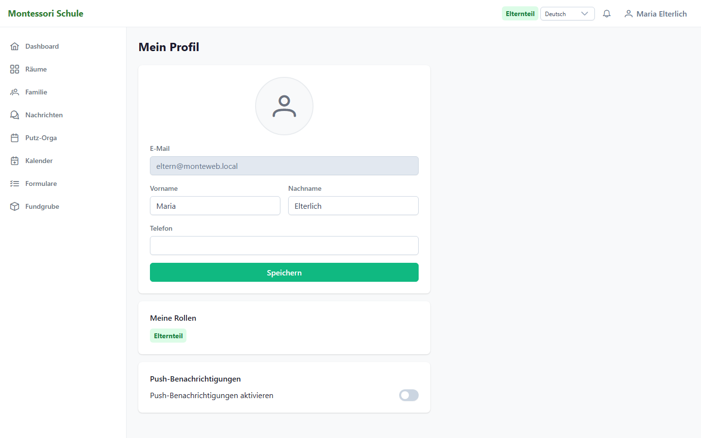

# MonteWeb Handbuch fuer Eltern

**Version:** 1.0 | **Stand:** Februar 2026 | **Rolle:** PARENT (Elternteil)

---

## Inhaltsverzeichnis

1. [Willkommen bei MonteWeb](#1-willkommen-bei-monteweb)
2. [Erste Schritte](#2-erste-schritte)
3. [Dashboard -- Ihre Startseite](#3-dashboard--ihre-startseite)
4. [Familienverbund](#4-familienverbund)
5. [Raeume](#5-raeume)
6. [Feed und Beitraege](#6-feed-und-beitraege)
7. [Nachrichten](#7-nachrichten)
8. [Jobboerse -- Elternstunden sammeln](#8-jobboerse--elternstunden-sammeln)
9. [Putz-Orga -- Putzstunden leisten](#9-putz-orga--putzstunden-leisten)
10. [Kalender und Termine](#10-kalender-und-termine)
11. [Formulare und Umfragen](#11-formulare-und-umfragen)
12. [Dateien und Fotobox](#12-dateien-und-fotobox)
13. [Fundgrube -- Verlorene Gegenstaende](#13-fundgrube--verlorene-gegenstaende)
14. [Profil und Einstellungen](#14-profil-und-einstellungen)
15. [Benachrichtigungen](#15-benachrichtigungen)
16. [Haeufige Fragen (FAQ)](#16-haeufige-fragen-faq)

---

## 1. Willkommen bei MonteWeb

MonteWeb ist das Schul-Intranet Ihrer Montessori-Schule. Als Elternteil nutzen Sie MonteWeb, um:

- **Neuigkeiten** aus den Raeumen Ihrer Kinder zu verfolgen
- **Elternstunden** durch Jobs und Putztermine zu sammeln
- **Termine** einzusehen und Zu-/Absagen zu geben
- **Formulare** und Umfragen zu beantworten
- **Nachrichten** an Lehrkraefte zu senden
- **Dateien und Fotos** aus den Raeumen einzusehen
- Ihren **Familienverbund** zu verwalten

### Was kann ich als Elternteil?

| Funktion | Verfuegbar |
|----------|:----------:|
| Feed und Beitraege lesen | Ja |
| Kommentare schreiben | Ja |
| Beitraege erstellen | Nein |
| Jobs annehmen (Jobboerse) | Ja |
| Putztermine belegen | Ja |
| Formulare beantworten | Ja |
| Nachrichten senden | An Lehrkraefte (immer), an andere Eltern (je nach Einstellung) |
| Termine einsehen + RSVP | Ja |
| Familienverwaltung | Ja |
| Dateien hochladen | Ja (in eigenen Raeumen) |
| Fotos hochladen | Je nach Raum-Einstellung |

---

## 2. Erste Schritte

### 2.1 Anmelden

1. Oeffnen Sie MonteWeb im Browser (die Adresse erhalten Sie von Ihrer Schule)
2. Geben Sie Ihre **E-Mail-Adresse** und Ihr **Passwort** ein
3. Klicken Sie auf **Anmelden**


> **Tipp:** Falls Ihre Schule Single Sign-On (SSO) nutzt, koennen Sie alternativ **Mit SSO anmelden** verwenden.

### 2.2 Erstmalige Registrierung

Falls die Selbstregistrierung aktiviert ist:

1. Klicken Sie auf **Registrieren** unter dem Login-Formular
2. Fuellen Sie aus: E-Mail, Vorname, Nachname, Passwort
3. Klicken Sie auf **Registrieren**

> **Hinweis:** Je nach Schuleinstellung muss ein Administrator Ihr Konto erst freischalten, bevor Sie sich anmelden koennen. Sie sehen dann die Meldung: *"Ihr Konto wartet auf Freischaltung durch einen Administrator."*

### 2.3 Passwort vergessen?

1. Klicken Sie auf **Passwort vergessen?** auf der Login-Seite
2. Geben Sie Ihre E-Mail-Adresse ein
3. Folgen Sie dem Link in der E-Mail

### 2.4 Navigation

**Am Computer (Desktop):**
- Links sehen Sie die **Seitenleiste (Sidebar)** mit allen Menuepunkten
- Menuepunkte: Dashboard, Raeume, Familie, Nachrichten, Jobbboerse, Putz-Orga, Kalender, Formulare, Fundgrube, Profil

**Am Handy:**
- Unten sehen Sie die **Navigationsleiste** mit den wichtigsten Punkten
- Ueber den **Mehr**-Button erreichen Sie weitere Funktionen

**Kopfzeile (oben):**
- Schulname/Logo (Klick = zurueck zum Dashboard)
- Rollen-Badge (zeigt "Elternteil" in Gruen)
- Benachrichtigungsglocke (zeigt ungelesene Anzahl)

---

## 3. Dashboard -- Ihre Startseite

Das Dashboard ist die erste Seite nach dem Anmelden. Hier sehen Sie:


### 3.1 Systembanner

Oben erscheinen wichtige Hinweise, z.B.:
- Putz-Erinnerungen fuer Ihre belegten Termine
- Abgesagte Termine
- Wichtige Schulankuendigungen

### 3.2 Elternstunden-Widget

Das Widget zeigt Ihren aktuellen Stundenstand:

| Anzeige | Bedeutung |
|---------|-----------|
| **Elternstunden** | Stunden aus der Jobboerse (bestaetigte + ausstehende) |
| **Putzstunden** | Stunden aus der Putz-Orga |
| **Fortschrittsbalken** | Wie viel vom Jahresziel bereits erreicht ist |

### 3.3 Offene Formulare

Hier sehen Sie bis zu 5 Formulare und Umfragen, die Sie noch nicht beantwortet haben:
- Titel und Typ (Umfrage oder Einwilligung)
- Frist (falls gesetzt)
- Klick fuehrt direkt zum Formular
- **"Alle anzeigen"** oeffnet die komplette Liste

### 3.4 Feed

Unter den Widgets erscheint der Feed mit Beitraegen aus allen Raeumen, denen Sie angehoeren.

---

## 4. Familienverbund

Der Familienverbund ist die zentrale Einheit fuer die Abrechnung Ihrer Elternstunden. Alle Stunden, die Sie oder Ihr Partner leisten, werden auf dem gemeinsamen Familienkonto gesammelt.



### 4.1 Familie erstellen

Falls Sie noch keiner Familie angehoeren:

1. Gehen Sie zu **Familie** in der Navigation
2. Klicken Sie auf **"Familienverbund erstellen"**
3. Geben Sie einen Familiennamen ein (z.B. "Familie Mueller")
4. Sie werden automatisch als Familienoberhaupt eingetragen

> **Wichtig:** Jedes Elternteil gehoert zu genau einem Familienverbund. Kinder koennen bei getrennten Eltern mehreren Familien zugeordnet sein.

### 4.2 Familienmitglieder einladen

So laden Sie Ihren Partner oder Ihre Kinder ein:

1. Im Familienverbund auf **"Mitglied einladen"** klicken
2. Person suchen (Name oder E-Mail eingeben)
3. **Rolle waehlen:**
   - **Elternteil** -- fuer Ihren Partner
   - **Kind** -- fuer Ihr Kind
4. **"Einladung senden"** klicken

Der Eingeladene erhaelt eine Benachrichtigung und kann die Einladung annehmen oder ablehnen.

### 4.3 Einladung annehmen

Wenn Sie selbst eingeladen wurden:

1. Klicken Sie auf die **Benachrichtigungsglocke** oben rechts
2. Sie sehen die Einladung mit "Eingeladen von [Name]"
3. Klicken Sie auf **"Annehmen"** oder **"Ablehnen"**

### 4.4 Stundenkonto einsehen

Im Familienverbund sehen Sie:

| Konto | Quelle |
|-------|--------|
| **Elternstunden** | Gesammelt durch Jobs aus der Jobboerse |
| **Putzstunden** | Gesammelt durch Putztermine (QR-Check-in) |

- **Bestaetigte Stunden** = Bereits gutgeschrieben
- **Ausstehende Stunden** = Noch nicht vom Ersteller bestaetigt
- **Verbleibend** = Noch zu leistende Stunden bis zum Jahresziel

### 4.5 Familienkalender

Unter dem Stundenkonto sehen Sie den **Familienkalender**:
- Termine, zu denen Familienmitglieder zugesagt haben
- iCal-Download moeglich (fuer externe Kalender-Apps)

### 4.6 Familie verlassen

Falls noetig, koennen Sie den Familienverbund verlassen:
1. Im Familienverbund auf **"Verlassen"** klicken
2. Bestaetigen Sie die Abfrage

---

## 5. Raeume

Raeume sind die Gruppen in MonteWeb -- z.B. die Klasse Ihres Kindes, eine Arbeitsgemeinschaft oder ein Projekt.

### 5.1 Meine Raeume

Unter **Raeume** in der Navigation sehen Sie alle Raeume, denen Sie angehoeren:


- Raum-Avatar und Name
- Raumtyp (Klasse, Gruppe, Projekt)

### 5.2 Raeume entdecken


Moechten Sie einem weiteren Raum beitreten?

1. Klicken Sie auf **"Raeume entdecken"** (oder **Entdecken** in der Navigation)
2. Sie sehen alle verfuegbaren Raeume
3. Je nach Raum-Einstellung:
   - **Offen** -- Sofort beitreten mit einem Klick
   - **Auf Anfrage** -- Beitrittsanfrage senden (mit optionaler Nachricht an die Leitung)
   - **Nur auf Einladung** -- Kein Beitritt moeglich

### 5.3 Raum-Detailansicht

Nach Klick auf einen Raum sehen Sie mehrere Tabs:

| Tab | Was Sie sehen |
|-----|---------------|
| **Info-Board** | Beitraege der Lehrkraefte im Raum-Feed |
| **Mitglieder** | Wer ist in diesem Raum? (Leitung, Familien, Mitglieder) |
| **Diskussionen** | Themen-Threads zum Mitlesen und Antworten |
| **Termine** | Raum-Kalender (falls Kalender-Modul aktiv) |
| **Chat** | Echtzeit-Chat im Raum (falls Nachrichten-Modul aktiv) |
| **Dateien** | Dokumente und Materialien (falls Dateien-Modul aktiv) |
| **Fotobox** | Foto-Galerien (falls Fotobox-Modul aktiv) |

### 5.4 Feed stummschalten

Wenn ein Raum zu viele Benachrichtigungen erzeugt:
1. In den Raum-Einstellungen auf **"Feed stummschalten"** klicken
2. Beitraege des Raums erscheinen nicht mehr im Haupt-Feed

---

## 6. Feed und Beitraege

### 6.1 Feed lesen

Der Feed auf dem Dashboard zeigt Beitraege aus allen Ihren Raeumen. Jeder Beitrag zeigt:
- Autor (Name + Bild)
- Zeitpunkt
- Titel und Inhalt
- Kommentar-Anzahl

> **Angepinnte Beitraege** erscheinen immer oben -- diese sind besonders wichtig!

### 6.2 Kommentieren

1. Klicken Sie auf einen Beitrag
2. Schreiben Sie Ihren Kommentar ins Textfeld
3. Klicken Sie auf **"Kommentieren"**

### 6.3 Raum-Feed (Info-Board)

Im Info-Board eines Raumes sehen Sie nur Beitraege aus diesem Raum. Als Elternteil koennen Sie keine eigenen Beitraege erstellen, aber Kommentare schreiben.

---

## 7. Nachrichten



### 7.1 Neue Nachricht senden

1. Gehen Sie zu **Nachrichten** in der Navigation
2. Klicken Sie auf **"Neue Nachricht"**
3. Suchen Sie den Empfaenger (Name oder E-Mail)
4. Schreiben Sie Ihre Nachricht
5. Klicken Sie auf **Senden**

### 7.2 Bilder senden

Sie koennen auch Bilder in Nachrichten anhaengen:
1. Klicken Sie auf das **Bild-Symbol** neben dem Textfeld
2. Waehlen Sie ein Bild aus (max. 10 MB, erlaubt: JPEG, PNG, WebP, GIF)
3. Senden Sie die Nachricht

### 7.3 Auf Nachrichten antworten

Sie koennen auf eine bestimmte Nachricht antworten:
1. Hovern Sie ueber die Nachricht
2. Klicken Sie auf **"Antworten"**
3. Ihre Antwort zeigt die Originalnachricht als Referenz

### 7.4 Konversationen verwalten

- Links sehen Sie alle laufenden Konversationen
- Ungelesene Nachrichten sind hervorgehoben
- Konversationen koennen geloescht werden (nur aus Ihrer Liste)

### 7.5 Kommunikationsregeln

| Mit wem? | Erlaubt? |
|----------|----------|
| Lehrkraefte | Immer erlaubt |
| Andere Eltern | Je nach Schuleinstellung (Standard: gesperrt) |
| Schueler | Nicht moeglich |

---

## 8. Jobboerse -- Elternstunden sammeln

Die Jobboerse ist der zentrale Ort, um **Elternstunden** zu sammeln. Lehrkraefte und Admins stellen Jobs ein, fuer die Sie sich bewerben koennen.



### 8.1 Jobs finden

1. Gehen Sie zu **Jobbboerse** in der Navigation
2. Sie sehen zwei Bereiche:
   - **Offene Jobs** -- Verfuegbare Aufgaben
   - **Meine Aufgaben** -- Ihre angenommenen Jobs

Jobs koennen nach **Kategorie** gefiltert werden:
- **Normal** -- Regulaere Elternstunden
- **Reinigung** -- Zaehlt als Putzstunden

### 8.2 Fuer einen Job anmelden

1. Klicken Sie auf einen offenen Job
2. Lesen Sie Beschreibung, Ort, Datum und geschaetzte Stunden
3. Klicken Sie auf **"Anmelden"**
4. Ihr Status wird zu "Zugewiesen"

### 8.3 Job durchfuehren und abschliessen

Der typische Ablauf:

```
Anmelden → Zugewiesen → Arbeit erledigen → Abschliessen → Bestaetigt
```

1. **Job erledigen** -- Fuehren Sie die Aufgabe aus
2. **"Abschliessen"** klicken -- Geben Sie die tatsaechlichen Stunden ein
3. **Warten auf Bestaetigung** -- Die Lehrkraft bestaetigt Ihre Stunden
4. **Stunden gutgeschrieben** -- Erscheinen im Familien-Stundenkonto

### 8.4 Job zurueckgeben

Falls Sie einen Job doch nicht erledigen koennen:
1. Oeffnen Sie den Job
2. Klicken Sie auf **"Zurueckgeben"**
3. Der Job wird wieder fuer andere Eltern verfuegbar

### 8.5 Abgeschlossene Jobs

Unter **"Abgeschlossene Jobs"** sehen Sie Ihre erledigten Aufgaben mit den gutgeschriebenen Stunden.

---

## 9. Putz-Orga -- Putzstunden leisten

Die Putz-Orga organisiert Reinigungsdienste an der Schule. Putzstunden werden auf einem separaten Konto gutgeschrieben.



### 9.1 Putztermine finden

1. Gehen Sie zu **Putz-Orga** in der Navigation
2. Sie sehen zwei Bereiche:
   - **Anstehende Termine** -- Alle verfuegbaren Putztermine
   - **Meine Termine** -- Ihre belegten Termine

Jeder Termin zeigt:
- Datum und Uhrzeit
- Titel der Putzaktion
- Belegung (z.B. "2/4 Plaetze belegt")
- Status (Offen, Voll, Laufend, Abgeschlossen)

### 9.2 Fuer einen Putztermin anmelden

1. Waehlen Sie einen Termin mit freien Plaetzen
2. Klicken Sie auf **"Eintragen"**
3. Sie werden als Teilnehmer eingetragen
4. Der Termin erscheint unter "Meine Termine"

### 9.3 Putztermin absagen

Falls Sie doch nicht koennen:
1. Gehen Sie zu "Meine Termine"
2. Klicken Sie auf **"Austragen"**

### 9.4 Tausch anbieten

Alternativ zum Absagen koennen Sie einen Tausch anbieten:
1. Klicken Sie auf **"Tausch anbieten"**
2. Andere Eltern sehen das Tausch-Angebot und koennen es annehmen
3. Bei Annahme werden Sie automatisch ausgetragen

### 9.5 Am Putztag: QR-Check-in

So funktioniert der Putztag:

1. **Einchecken:** Am Putzort den QR-Code scannen (mit Smartphone-Kamera oder Code manuell eingeben)
2. **Putzen:** Fuehren Sie den Reinigungsdienst durch
3. **Auschecken:** Erneut QR-Code scannen
4. **Stunden gutgeschrieben:** Die Putzstunden erscheinen automatisch auf Ihrem Familien-Putzstundenkonto

> **Tipp:** Haben Sie den QR-Code nicht zur Hand? Sie koennen den Code auch manuell auf der Putz-Orga-Seite eingeben.

---

## 10. Kalender und Termine

### 10.1 Kalender einsehen



Unter **Kalender** in der Navigation sehen Sie:
- Monatsnavigation (vor/zurueck, "Heute"-Button)
- Termine als Liste, geordnet nach Datum
- Farbcodierung: Raum-Termine, Bereichs-Termine, schulweite Termine
- Abgesagte Termine mit "Abgesagt"-Markierung

### 10.2 Zu-/Absagen (RSVP)

Fuer jeden Termin koennen Sie Ihre Teilnahme angeben:

1. Klicken Sie auf den Termin
2. Waehlen Sie:
   - **Zusage** (gruen) -- Sie nehmen teil
   - **Vielleicht** (gelb) -- Sie sind unsicher
   - **Absage** (rot) -- Sie koennen nicht

Die Anzahl der Zu-/Absagen wird live angezeigt.

### 10.3 Familienkalender

Im Familienverbund gibt es den **Familienkalender**:
- Zeigt alle Termine, zu denen Familienmitglieder zugesagt haben
- **iCal-Download** moeglich -- importieren Sie den Kalender in Ihren persoenlichen Kalender (Google Calendar, Apple Kalender etc.)

---

## 11. Formulare und Umfragen



### 11.1 Formulare finden

Offene Formulare werden Ihnen auf zwei Wegen angezeigt:
- Im **Dashboard-Widget** (bis zu 5 offene Formulare)
- Unter **Formulare** in der Navigation

### 11.2 Formular beantworten

1. Klicken Sie auf ein Formular
2. Beantworten Sie alle Fragen:
   - **Freitext** -- Text eingeben
   - **Einfachauswahl** -- Eine Option waehlen
   - **Mehrfachauswahl** -- Mehrere Optionen waehlen
   - **Bewertung** -- Sterne vergeben
   - **Ja/Nein** -- Zustimmen oder ablehnen
3. Klicken Sie auf **"Antwort absenden"**

> **Hinweis:** Pflichtfragen sind markiert und muessen beantwortet werden.

### 11.3 Einwilligungserklaerungen

Bei Formularen vom Typ **"Einwilligung"** (orange markiert) muessen Sie explizit Ja oder Nein waehlen. Diese dienen z.B. fuer Foto-Erlaubnisse oder Ausflugs-Genehmigungen.

### 11.4 Bereits beantwortet?

Formulare, die Sie schon beantwortet haben, sind mit einem gruenen Haekchen markiert. Sie koennen Ihre Antwort nicht nachtraeglich aendern.

---

## 12. Dateien und Fotobox

### 12.1 Dateien einsehen

Im Tab **Dateien** eines Raumes finden Sie:
- Ordnerstruktur mit Breadcrumb-Navigation
- Dokumente und Materialien der Lehrkraefte
- Herunterladen per Klick auf den Dateinamen

### 12.2 Dateien hochladen

Als Elternteil koennen Sie Dateien in Raeumen hochladen:
1. Im Raum auf den Tab **Dateien** wechseln
2. Klicken Sie auf **"Hochladen"**
3. Datei(en) auswaehlen

### 12.3 Ordner erstellen

Wenn Sie einen Ordner erstellen, wird die Sichtbarkeit automatisch auf **"Nur Eltern"** gesetzt. Das bedeutet: Nur andere Eltern und Lehrkraefte sehen diesen Ordner. Schueler sehen ihn nicht.

### 12.4 Fotobox

Die Fotobox zeigt Foto-Galerien im Raum:
- **Threads** -- Sammlungen von Fotos zu einem Thema
- **Bilder ansehen** -- Klick oeffnet die Lightbox (Vollbild-Ansicht)
- **Bilder hochladen** -- Je nach Raum-Einstellung (max. 20 Bilder pro Upload)

> **Hinweis:** Wenn Sie einen Foto-Thread erstellen, wird die Sichtbarkeit automatisch auf **"Nur Eltern"** gesetzt.

### 12.5 Sichtbarkeit

Manche Ordner und Foto-Threads sind nur fuer bestimmte Gruppen sichtbar:
- **Alle** -- Jeder im Raum sieht den Inhalt
- **Nur Eltern** (orange) -- Nur Eltern und Lehrkraefte
- **Nur Schueler** (blau) -- Nur Schueler und Lehrkraefte

Sie sehen immer nur die Inhalte, die fuer Ihre Rolle freigegeben sind.

---

## 13. Fundgrube -- Verlorene Gegenstaende

Die Fundgrube ist eine schulweite Funktion fuer verlorene Gegenstaende.



### 13.1 Fundgrube einsehen

Unter **Fundgrube** in der Navigation sehen Sie alle gemeldeten Gegenstaende:
- Foto des Gegenstands
- Bezeichnung
- Schulbereich (z.B. "Grundstufe")
- Wer es gemeldet hat
- Seit wann es in der Fundgrube ist

Sie koennen nach **Schulbereich** filtern.

### 13.2 Gegenstand melden

Haben Sie etwas gefunden?

1. Klicken Sie auf **"Gegenstand melden"**
2. Bezeichnung eingeben (z.B. "Blaue Trinkflasche")
3. Optional: Schulbereich waehlen
4. Optional: Foto(s) hochladen
5. **"Speichern"**

### 13.3 Gegenstand beanspruchen

Erkennen Sie einen Gegenstand als Ihren?

1. Klicken Sie auf **"Das gehoert mir!"**
2. Optional: Kommentar zur Identifikation eingeben
3. Bestaetigen
4. Der Melder wird benachrichtigt
5. Der Eintrag wird nach 24 Stunden automatisch entfernt

---

## 14. Profil und Einstellungen



### 14.1 Profil bearbeiten

Unter **Profil** koennen Sie aendern:
- **Avatar** -- Profilbild hochladen oder entfernen
- **Vorname** und **Nachname**
- **Telefonnummer** (optional)

### 14.2 Rollenwechsel

Falls Sie mehrere Rollen haben (z.B. PARENT + TEACHER):
1. Auf der Profilseite sehen Sie alle Ihre Rollen
2. Klicken Sie auf eine andere Rolle zum Wechseln
3. Die Anzeige passt sich automatisch an

### 14.3 Push-Benachrichtigungen

Aktivieren Sie Push-Benachrichtigungen, um auch bei geschlossenem Browser informiert zu werden:
1. Auf der Profilseite den Toggle **"Push-Benachrichtigungen"** aktivieren
2. Erlauben Sie die Browser-Benachrichtigungen

### 14.4 App installieren (PWA)

MonteWeb kann wie eine App auf Ihrem Handy installiert werden:
1. Ein Banner zeigt **"MonteWeb installieren"**
2. Klicken Sie auf **"Installieren"**
3. Die App erscheint auf Ihrem Startbildschirm

### 14.5 DSGVO-Funktionen

Am unteren Rand der Profilseite:
- **Daten exportieren** -- Alle Ihre gespeicherten Daten als Datei herunterladen
- **Konto loeschen** -- Loescht Ihr Konto und anonymisiert alle Daten unwiderruflich

---

## 15. Benachrichtigungen

### 15.1 Wo sehe ich Benachrichtigungen?

- **Glocken-Symbol** oben rechts -- Zeigt die Anzahl ungelesener Benachrichtigungen
- Klick auf die Glocke zeigt alle Benachrichtigungen

### 15.2 Welche Benachrichtigungen bekomme ich?

| Ereignis | Wann |
|----------|------|
| Neuer Beitrag | Jemand postet in einem Ihrer Raeume |
| Antwort auf Kommentar | Jemand antwortet auf Ihren Kommentar |
| Neue Nachricht | Sie erhalten eine Direktnachricht |
| Familien-Einladung | Jemand laedt Sie in einen Familienverbund ein |
| Beitrittsanfrage genehmigt | Ihre Raum-Anfrage wurde akzeptiert |
| Job-Zuweisung | Ein Job wurde Ihnen zugewiesen |
| Job bestaetigt | Ihre Stunden wurden gutgeschrieben |
| Putz-Erinnerung | Ihr Putztermin steht bevor |
| Neues Formular | Ein neues Formular/Umfrage ist verfuegbar |
| Termin abgesagt | Ein Termin wurde abgesagt |

### 15.3 Alle als gelesen markieren

Klicken Sie auf **"Alle gelesen"** um den Zaehler zurueckzusetzen.

---

## 16. Haeufige Fragen (FAQ)

### Allgemein

**Ich kann mich nicht anmelden. Was tun?**
- Pruefen Sie E-Mail und Passwort
- Nutzen Sie "Passwort vergessen?" zum Zuruecksetzen
- Moeglicherweise muss Ihr Konto erst von einem Admin freigeschaltet werden

**Wo finde ich die Schul-Adresse fuer MonteWeb?**
- Fragen Sie die Schulverwaltung oder Klassenlehrerin

**Ich sehe bestimmte Menuepunkte nicht. Warum?**
- Manche Module (Nachrichten, Jobboerse, Putz-Orga etc.) koennen von der Schule deaktiviert sein
- "Verwaltung" sehen nur Admins, "Bereichsverwaltung" nur Section Admins

### Familie

**Kann ich mehreren Familienverbuenden angehoeren?**
- Nein, als Elternteil gehoeren Sie zu genau einem Familienverbund
- Kinder koennen bei getrennten Eltern mehreren Familien zugeordnet sein

**Mein Partner soll auch Stunden sehen. Wie?**
- Laden Sie Ihren Partner als "Elternteil" in den Familienverbund ein
- Beide sehen dann das gemeinsame Stundenkonto

### Jobboerse

**Ich habe einen Job angenommen, kann ihn aber nicht erledigen.**
- Geben Sie den Job zurueck ueber "Zurueckgeben" auf der Job-Detailseite
- Der Job wird wieder fuer andere verfuegbar

**Meine Stunden wurden nicht gutgeschrieben.**
- Nach dem Abschliessen muss die Lehrkraft die Stunden bestaetigen
- Sprechen Sie die Lehrkraft an, falls die Bestaetigung laenger dauert

### Putz-Orga

**Wie bekomme ich einen QR-Code zum Einchecken?**
- Der QR-Code haengt am Putzort aus
- Alternativ: Code manuell auf der Putz-Orga-Seite eingeben

**Ich habe vergessen auszuchecken.**
- Kontaktieren Sie die Putz-Organisation (PutzOrga) Ihres Bereichs oder den Admin

**Was ist der Unterschied zwischen Elternstunden und Putzstunden?**
- **Elternstunden** = Jobs aus der Jobboerse (normale Aufgaben)
- **Putzstunden** = Aus der Putz-Orga (separates Konto, separates Jahresziel)

### Nachrichten

**Ich kann einem anderen Elternteil keine Nachricht senden.**
- Eltern-zu-Eltern-Kommunikation ist standardmaessig gesperrt
- Die Schule kann dies in den Einstellungen freischalten

---

*MonteWeb Eltern-Handbuch -- Version 1.0 -- Februar 2026*
